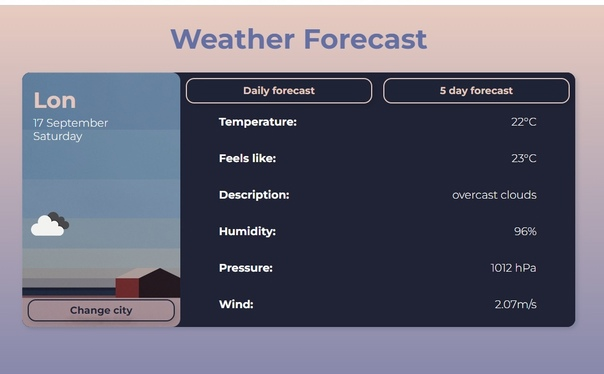

# React Weather Forecast

Weather app gathers data from OpenWeatherMap, their public API.
***

## Features

- Simple design
- Current weather
- Detailed weather forecast
- Works with any city in the world
- Shortcut support
- Mobile version

***

## Tech stack
- Javascript, CSS, HTML
- React.js
- React Hooks
- Function component
- Modal styles 
- React-router-dom
- Redux, Redux-thunk, React-Redux
- Axios

***
 ## Screenshot

***
### Deployment
https://voro-na.github.io/forecast/